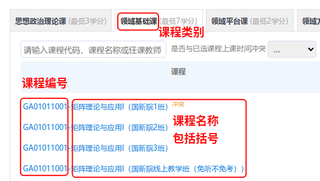

# 北航研究生自动选课脚本

## 1. 环境准备

```shell
pip install -r requirements.txt
```

然后安装 Google Chrome 浏览器，下载对应版本的 chromedriver，保存在 `yjsxk` 目录下的 `driver` 文件夹中。

## 2. 使用方法

### 2.1 获取登录信息

```shell
cd src
python main.py -t login
```

然后在页面登录即可，完成后自动关闭浏览器。

### 2.2 选课

```shell
python main.py -t select -c 课程类别 -i 课程编号 -n 课程名称 
```

可选参数：
```text
--min_wait 最小等待刷新时间，默认 2s
--max_wait 最大等待刷新时间，默认 8s
```


